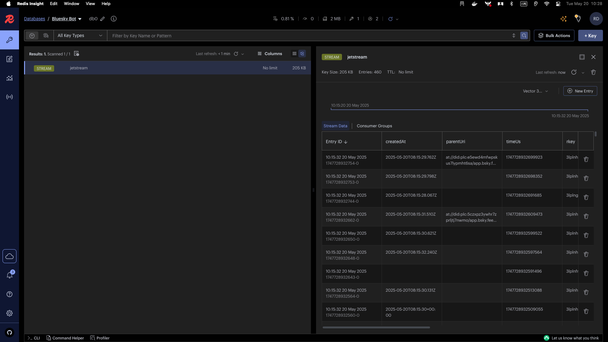
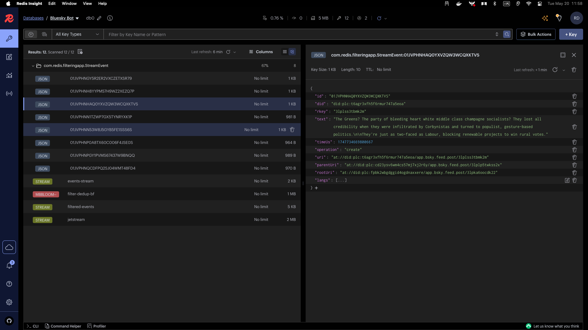
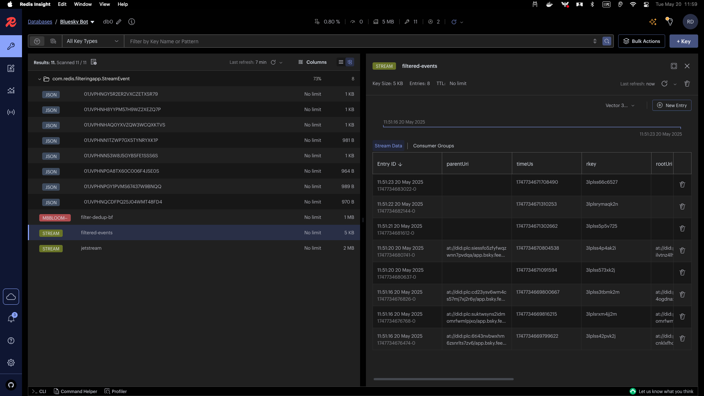

# Building a Bluesky Bot with Java and Redis

## Introduction

Welcome to this workshop on building a Bluesky social network bot using Java and Redis! In this workshop, you'll learn how to build a complete bot that can analyze posts from the Bluesky network, identify trending topics, and respond to user queries about the content.

You'll learn how to use Redis as the core data platform alongside vector search and Large Language Models (LLMs) to build an intelligent data processing pipeline.

## Prerequisites

To follow this workshop, you'll need:

- Basic knowledge of Java
- Docker for running Redis Open Source 8 (which includes Redis Query Engine and Probabilistic Data Structures)
- An Ollama installation for running LLMs locally (or OpenAI API key)
- A Bluesky account for testing the bot
- Java 21 or higher
- Maven or Gradle for dependency management

## Getting Started

1. Clone the repository
2. Start Redis Open Source 8 using Docker:
   ```bash
   docker run --name my-redis -p 6379:6379 redis
   ```
   This provides Redis with all the necessary modules (Redis Query Engine, RedisJSON, etc.).
3. Install Redis Insight for visualizing the data: https://redis.io/docs/latest/operate/redisinsight/install/
4. Verify Redis is running:
   ```bash
   docker exec -it my-redis redis-cli ping
   ```
   This should return "PONG".
5. Start Ollama with the Deepseek Coder model:
   ```bash
   ollama run deepseek-coder-v2
   ```
6. Set up your Java project with the required dependencies (see below)

## Required Dependencies

For this workshop, you'll need the following dependencies:

```kotlin
dependencies {
   // Redis OM Spring
   implementation("com.redis.om:redis-om-spring:1.0.0-RC1")
   implementation("com.redis.om:redis-om-spring-ai:1.0.0-RC1")
    
   // Spring AI with Ollama
   implementation("org.springframework.ai:spring-ai-ollama:1.0.0-RC1")

   // DJL for machine learning
   implementation("ai.djl:api:0.33.0")
   implementation("ai.djl.huggingface:tokenizers:0.33.0")
   implementation("ai.djl.pytorch:pytorch-engine:0.33.0")
}
```

## Workshop Overview

This workshop is divided into five parts, each building on the previous one:

1. **JetStream Consumer**: Connect to Bluesky's Jetstream Websocket and store events in Redis Streams
2. **JetStream Filtering**: Filter events using Redis Bloom Filter and machine learning
3. **Events Enrichment**: Enrich events with topic modeling and vector embeddings
4. **Data Analysis with AI**: Build a question-answering system using Redis and LLMs
5. **Building the Bot**: Create a bot that interacts with users on Bluesky

Let's get started!

## Part 1: Consuming Bluesky's Jetstream Websocket

In this part, we'll connect to Bluesky's Jetstream Websocket to receive real-time events and store them in Redis Streams.

### Understanding Bluesky's Jetstream and Redis Streams

Bluesky's Jetstream Websocket provides a stream of events from the Bluesky network. These events include posts, likes, follows, and other user activities. Redis Streams are a data structure that allows you to store and consume a stream of events, similar to Kafka topics but simpler to use.

### Required dependencies

```kotlin
dependencies {
   implementation("org.springframework.boot:spring-boot-starter-web")
   implementation("org.springframework.boot:spring-boot-starter-websocket")
   
   // Redis OM Spring
   implementation("com.redis.om:redis-om-spring:1.0.0-RC1")
}
```

### Modeling the Event Data

First, let's create a model to represent the events from Bluesky's Jetstream:

```java
package com.redis.consumerapp;

import com.fasterxml.jackson.annotation.JsonIgnoreProperties;
import com.fasterxml.jackson.annotation.JsonProperty;
import com.fasterxml.jackson.core.JsonProcessingException;
import com.fasterxml.jackson.databind.ObjectMapper;

import java.util.HashMap;
import java.util.List;
import java.util.Map;

@JsonIgnoreProperties(ignoreUnknown = true)
public class BlueskyEvent {
   public String did;

   @JsonProperty("time_us")
   public long timeUs;

   public String kind;
   public Commit commit;

   @JsonIgnoreProperties(ignoreUnknown = true)
   public static class Commit {
      public String rev;
      public String operation;
      public String collection;
      public String rkey;
      public Record record;
      public String cid;
   }

   @JsonIgnoreProperties(ignoreUnknown = true)
   public static class Record {
      @JsonProperty("$type")
      public String type;

      public String createdAt;
      public String text;
      public List<String> langs;
      public List<Facet> facets;
      public Reply reply;
      public Embed embed;
   }

   @JsonIgnoreProperties(ignoreUnknown = true)
   public static class Reply {
      public PostRef parent;
      public PostRef root;
   }

   @JsonIgnoreProperties(ignoreUnknown = true)
   public static class PostRef {
      public String cid;
      public String uri;
   }

   @JsonIgnoreProperties(ignoreUnknown = true)
   public static class Facet {
      @JsonProperty("$type")
      public String type;

      public List<Feature> features;
      public Index index;
   }

   @JsonIgnoreProperties(ignoreUnknown = true)
   public static class Feature {
      @JsonProperty("$type")
      public String type;
      public String did;
   }

   @JsonIgnoreProperties(ignoreUnknown = true)
   public static class Index {
      public int byteStart;
      public int byteEnd;
   }

   @JsonIgnoreProperties(ignoreUnknown = true)
   public static class Embed {
      @JsonProperty("$type")
      public String type;
      public List<EmbedImage> images;
   }

   @JsonIgnoreProperties(ignoreUnknown = true)
   public static class EmbedImage {
      public String alt;
      public AspectRatio aspectRatio;
      public Image image;
   }

   @JsonIgnoreProperties(ignoreUnknown = true)
   public static class AspectRatio {
      public int height;
      public int width;
   }

   @JsonIgnoreProperties(ignoreUnknown = true)
   public static class Image {
      @JsonProperty("$type")
      public String type;
      public Ref ref;
      public String mimeType;
      public int size;
   }

   @JsonIgnoreProperties(ignoreUnknown = true)
   public static class Ref {
      @JsonProperty("$link")
      public String link;
   }

   public static BlueskyEvent fromJson(String json) {
      ObjectMapper mapper = new ObjectMapper();
      BlueskyEvent event;
      try {
         event = mapper.readValue(json, BlueskyEvent.class);
      } catch (JsonProcessingException e) {
         throw new RuntimeException(e);
      }
      return event;
   }

   public Map<String, String> toMap() {
      Map<String, String> map = new HashMap<>();
      map.put("did", did);
      map.put("createdAt", commit != null && commit.record != null ? String.valueOf(commit.record.createdAt) : "");
      map.put("timeUs", String.valueOf(timeUs));
      map.put("text", commit != null && commit.record != null ? String.valueOf(commit.record.text) : "");
      map.put("langs", commit != null && commit.record != null ? String.valueOf(commit.record.langs) : "");
      map.put("operation", commit != null ? String.valueOf(commit.operation) : "");
      map.put("rkey", commit != null ? String.valueOf(commit.rkey) : "");
      map.put("parentUri", commit != null && commit.record != null && commit.record.reply != null && commit.record.reply.parent != null ? commit.record.reply.parent.uri : "");
      map.put("rootUri", commit != null && commit.record != null && commit.record.reply != null && commit.record.reply.root != null ? commit.record.reply.root.uri : "");
      map.put("uri", commit != null ? "at://" + did + "/app.bsky.feed.post/" + commit.rkey : "");
      return map;
   }
}
```

### Creating a WebSocket Client

Now, let's create a WebSocket client to connect to Bluesky's Jetstream:

```java
package com.redis.consumerapp;

import jakarta.websocket.*;
import org.slf4j.Logger;
import org.slf4j.LoggerFactory;
import org.springframework.stereotype.Component;

import java.io.IOException;
import java.net.URI;

@Component
@ClientEndpoint
public class JetstreamClient {

   private static final Logger logger = LoggerFactory.getLogger(JetstreamClient.class);

   private Session session;
   private URI endpointURI;
   private boolean manuallyClosed = false;

   @OnOpen
   public void onOpen(Session session) {
      System.out.println("✅ Connected to Jetstream");
   }

   @OnMessage
   public void onMessage(String message) {
      System.out.println("🔔 Received message: " + message);
      // TODO: parse message into Event and process
   }

   @OnClose
   public void onClose(Session session, CloseReason closeReason) {
      logger.info("Disconnected: " + closeReason);
      if (!manuallyClosed) {
         tryReconnect();
      }
   }

   @OnError
   public void onError(Session session, Throwable throwable) {
      System.err.println("WebSocket error: " + throwable.getMessage());
      if (!manuallyClosed) {
         tryReconnect();
      }
   }

   public void start() throws Exception {
      start("wss://jetstream2.us-east.bsky.network/subscribe?wantedCollections=app.bsky.feed.post");
   }

   public void start(String uri) throws Exception {
      this.endpointURI = new URI(uri);
      connect();
   }

   private void connect() throws Exception {
      WebSocketContainer container = ContainerProvider.getWebSocketContainer();
      this.session = container.connectToServer(this, endpointURI);
   }

   private void tryReconnect() {
      new Thread(() -> {
         int attempts = 0;
         while (!manuallyClosed) {
            try {
               Thread.sleep(Math.min(30000, 2000 * ++attempts)); // exponential up to 30s
               logger.info("Trying to reconnect... attempt " + attempts);
               connect();
               logger.info("Reconnected!");
               break;
            } catch (Exception e) {
               System.err.println("Reconnect failed: " + e.getMessage());
            }
         }
      }).start();
   }

   public void stop() throws IOException {
      manuallyClosed = true;
      if (session != null && session.isOpen()) {
         session.close();
      }
   }
}
```

### Adding Events to Redis Streams

Now, let's create a function to add events to a Redis Stream:

```java
package com.redis.consumerapp;

import org.springframework.stereotype.Service;
import redis.clients.jedis.JedisPooled;
import redis.clients.jedis.StreamEntryID;
import redis.clients.jedis.params.XAddParams;

import java.util.Map;

@Service
public class RedisStreamService {

   private final JedisPooled jedisPooled;

   public RedisStreamService(JedisPooled jedisPooled) {
      this.jedisPooled = jedisPooled;
   }

   public void addToStream(String streamName, Map<String, String> hash) {
      jedisPooled.xadd(
              streamName,
              XAddParams.xAddParams()
                      .id(StreamEntryID.NEW_ENTRY)
                      .maxLen(1_000_000)
                      .exactTrimming(),
              hash
      );
   }
}
```

### Putting It All Together

Finally, let's create a main class to run our Jetstream consumer:

```java
package com.redis.consumerapp;

import org.springframework.boot.CommandLineRunner;
import org.springframework.boot.SpringApplication;
import org.springframework.boot.autoconfigure.SpringBootApplication;
import org.springframework.context.annotation.Bean;
import redis.clients.jedis.JedisPooled;

@SpringBootApplication
public class Application {

   public static void main(String[] args) {
      SpringApplication.run(Application.class, args);
   }

   @Bean
   public JedisPooled jedisPooled() {
      return new JedisPooled();
   }

   @Bean
   public CommandLineRunner run(
           JetstreamClient client,
           RedisStreamService redisStreamService) {
      return args -> {
         client.setMessageConsumer(message -> {
            BlueskyEvent blueskyEvent = BlueskyEvent.fromJson(message);
            redisStreamService.addToStream("jetstream", blueskyEvent.toMap());
         });
         client.start();
      };
   }
}
```

After running the application, you see logs similar to the ones below:

```bash
2025-05-20T10:15:19.999+02:00  INFO 42233 --- [1-consumer-app] [           main] com.redis.consumerapp.Application        : Started Application in 0.885 seconds (process running for 1.11)
✅ Connected to Jetstream
🔔 Received message: {"did":"did:plc:k77e63e2jxhevskb75l2gpio","time_us":1747728920491866,"kind":"commit","commit":{"rev":"3lplngqxr7y2e","operation":"create","collection":"app.bsky.feed.post","rkey":"3lplngnsi6224","record":{"$type":"app.bsky.feed.post","createdAt":"2025-05-20T08:15:16.553Z","embed":{"$type":"app.bsky.embed.images","images":[{"alt":"","aspectRatio":{"height":2000,"width":1500},"image":{"$type":"blob","ref":{"$link":"bafkreiffafgoxhv33pddoi343wnfcdjbfhaxsobpkvsvqgumswlpyeps6a"},"mimeType":"image/jpeg","size":984407}}]},"langs":["en"],"reply":{"parent":{"cid":"bafyreifvp4lrhf7t3dt4zpv4rt6rcqmrqykwmoxurhq7x67cgeberpmesq","uri":"at://did:plc:k77e63e2jxhevskb75l2gpio/app.bsky.feed.post/3lplfkayc2k22"},"root":{"cid":"bafyreibzawfdaobv4shlu3rylu2n4pur3vlxiw7vbp6zcjj46jxtcndlpm","uri":"at://did:plc:k77e63e2jxhevskb75l2gpio/app.bsky.feed.post/3lplfilhcms22"}},"text":"he keeps furiously grooming them to get them to lay flat but they stick out like little alfalfas"},"cid":"bafyreidkubkdu4if3uh7flwoajig6wmzoqvhp2iutg3sszsdc3ynhejj4m"}}
🔔 Received message: {"did":"did:plc:yrzxdj6jhsnfkfekxlo34m6n","time_us":1747728920493261,"kind":"commit","commit":{"rev":"3lplngr6fux2h","operation":"create","collection":"app.bsky.feed.post","rkey":"3lplngryztc2f","record":{"$type":"app.bsky.feed.post","createdAt":"2025-05-20T08:15:20.969Z","embed":{"$type":"app.bsky.embed.record","record":{"cid":"bafyreig6qh6kawltkxbcckrmp53mjxtj6vd3s7zkl54qcbuofw6httware","uri":"at://did:plc:exxdcplb2ozev5lvw5ohnejq/app.bsky.feed.post/3lpl5imv5ys2c"}},"langs":["en"],"text":"I want to like Wes Anderson films, but the way every character delivers his dialogue annoys me too much. Plus you can practically smell the \"look how twee and quirky I am\" like someone playing Wonderwall on a ukelele"},"cid":"bafyreiddbns7ingakcalgbo4vxfdkbpsmtkrxngo3k7rgped34botqcwim"}}
```


And on Redis Insight, you can see the data being added to the stream:



## Part 2: Filtering JetStream Events

In this part, we'll filter events from the Redis Stream that we created in Part 1. We'll use a combination of techniques:

1. Deduplication using Redis Bloom Filter
2. Content-based filtering using a zero-shot classification machine learning model with Deep Java Library (DJL)
3. Storing filtered events in Redis for further processing

### Required Dependencies

For this part, you'll need the following dependencies:

```kotlin
dependencies {
   implementation("org.springframework.boot:spring-boot-starter")
   implementation("org.springframework.ai:spring-ai-starter-model-openai")
   implementation("org.springframework.ai:spring-ai-starter-model-bedrock")
   implementation("org.springframework.ai:spring-ai-starter-model-ollama")

   // Redis OM Spring
   implementation("com.redis.om:redis-om-spring:1.0.0-RC1")
   implementation("com.redis.om:redis-om-spring-ai:1.0.0-RC1")

   // DJL for machine learning
   implementation("ai.djl:api:0.33.0")
   implementation("ai.djl.huggingface:tokenizers:0.33.0")
   implementation("ai.djl.pytorch:pytorch-engine:0.33.0")
}
```

### Modeling Redis Stream Events

First, let's create a simplified Event class to represent events from the Redis Stream:

```java
package com.redis.filteringapp;

import com.redis.om.spring.annotations.Document;
import com.redis.om.spring.annotations.Indexed;
import com.redis.om.spring.annotations.VectorIndexed;
import com.redis.om.spring.annotations.Vectorize;
import com.redis.om.spring.indexing.DistanceMetric;
import org.springframework.data.annotation.Id;
import redis.clients.jedis.resps.StreamEntry;
import java.util.Arrays;
import java.util.HashMap;
import java.util.List;
import java.util.Map;

@Document
public class StreamEvent {

   @Id
   private String id;
   private String did;
   private String rkey;

   @Vectorize(destination = "textEmbedding")
   private String text;

   @VectorIndexed(distanceMetric = DistanceMetric.COSINE, dimension = 384)
   private float[] textEmbedding;

   @Indexed
   private Long timeUs;
   private String operation;
   private String uri;
   private String parentUri;
   private String rootUri;

   @Indexed
   private List<String> langs;

   public StreamEvent(String id, String did, String rkey, String text, Long timeUs,
                      String operation, String uri, String parentUri,
                      String rootUri, List<String> langs) {
      this.id = id;
      this.did = did;
      this.rkey = rkey;
      this.text = text;
      this.timeUs = timeUs;
      this.operation = operation;
      this.uri = uri;
      this.parentUri = parentUri;
      this.rootUri = rootUri;
      this.langs = langs;
   }

   public static StreamEvent fromStreamEntry(StreamEntry entry) {
      Map<String, String> fields = entry.getFields();

      String langsStr = fields.getOrDefault("langs", "[]");
      List<String> langs = Arrays.asList(
              langsStr.replace("[", "").replace("]", "").split(", ")
      );

      return new StreamEvent(
              fields.getOrDefault("uri", ""), // ID
              fields.getOrDefault("did", ""),
              fields.getOrDefault("rkey", ""),
              fields.getOrDefault("text", ""),
              Long.parseLong(fields.getOrDefault("timeUs", "0")),
              fields.getOrDefault("operation", ""),
              fields.getOrDefault("uri", ""),
              fields.getOrDefault("parentUri", ""),
              fields.getOrDefault("rootUri", ""),
              langs
      );
   }

   // Convert to Map for Redis Stream
   public Map<String, String> toMap() {
      Map<String, String> map = new HashMap<>();
      map.put("did", this.did);
      map.put("rkey", this.rkey);
      map.put("text", this.text);
      map.put("timeUs", this.timeUs.toString());
      map.put("operation", this.operation);
      map.put("uri", this.uri);
      map.put("parentUri", this.parentUri);
      map.put("rootUri", this.rootUri);
      map.put("langs", this.langs.toString());
      return map;
   }

   // Getters
   public String getDid() { return did; }
   public String getRkey() { return rkey; }
   public String getText() { return text; }
   public Long getTimeUs() { return timeUs; }
   public String getOperation() { return operation; }
   public String getUri() { return uri; }
   public String getParentUri() { return parentUri; }
   public String getRootUri() { return rootUri; }
   public List<String> getLangs() { return langs; }
}
```

### Creating a Stream Event Repository
Next, let's create a repository for the StreamEvent class:

```java
package com.redis.filteringapp;

import com.redis.om.spring.repository.RedisDocumentRepository;

public interface StreamEventRepository extends RedisDocumentRepository<StreamEvent, String> {
}
```

### Reading from the Stream
Let's create the following methods:
- `createConsumerGroup`: Create a consumer group for the Redis Stream
- `readFromStream`: Read events from the Redis Stream
- `acknowledge`: Acknowledge the event after processing
- `addToStream`: Add an event to the Redis Stream

Let's create a method to read from the stream as part of a consumer group:

```java
package com.redis.filteringapp;

import org.springframework.stereotype.Service;
import redis.clients.jedis.JedisPooled;
import redis.clients.jedis.StreamEntryID;
import redis.clients.jedis.exceptions.JedisDataException;
import redis.clients.jedis.params.XAddParams;
import redis.clients.jedis.params.XReadGroupParams;
import redis.clients.jedis.resps.StreamEntry;

import java.util.Collections;
import java.util.HashMap;
import java.util.List;
import java.util.Map;

@Service
public class RedisStreamService {

    private final JedisPooled jedisPooled;

    public RedisStreamService(JedisPooled jedisPooled) {
        this.jedisPooled = jedisPooled;
    }

    public void addToStream(String streamName, Map<String, String> hash) {
        jedisPooled.xadd(
                streamName,
                XAddParams.xAddParams()
                        .id(StreamEntryID.NEW_ENTRY)
                        .maxLen(1_000_000)
                        .exactTrimming(),
                hash
        );
    }

    public void acknowledgeMessage(
            String streamName,
            String consumerGroup,
            StreamEntry entry) {
        jedisPooled.xack(streamName, consumerGroup, entry.getID());
    }

    public void createConsumerGroup(String streamName, String consumerGroupName) {
        try {
            jedisPooled.xgroupCreate(streamName, consumerGroupName, new StreamEntryID("0-0"), true);
        } catch (JedisDataException e) {
            System.out.println("Group already exists");
        }
    }

    public List<Map.Entry<String, List<StreamEntry>>> readFromStream(
            String streamName, String consumerGroup, String consumer, int count) {

        Map<String, StreamEntryID> streams = new HashMap<>();
        streams.put(streamName, StreamEntryID.XREADGROUP_UNDELIVERED_ENTRY);

        List<Map.Entry<String, List<StreamEntry>>> entries = jedisPooled.xreadGroup(
                consumerGroup,
                consumer,
                XReadGroupParams.xReadGroupParams().count(count),
                streams
        );

        return entries != null ? entries : Collections.emptyList();
    }
}
```

### Using Redis Bloom Filter for Deduplication

Let's create a BloomFilterService to create, add, and check the Bloom Filter:

```java
package com.redis.filteringapp;

import com.redis.om.spring.ops.pds.BloomOperations;
import org.slf4j.Logger;
import org.slf4j.LoggerFactory;
import org.springframework.stereotype.Service;
import redis.clients.jedis.exceptions.JedisDataException;

@Service
public class BloomFilterService {
    private final Logger logger = LoggerFactory.getLogger(BloomFilterService.class);
    private final BloomOperations<String> opsForBloom;

    public BloomFilterService(BloomOperations<String> opsForBloom) {
        this.opsForBloom = opsForBloom;
    }

    public void createBloomFilter(String name) {
        try {
            opsForBloom.createFilter(name, 1_000_000L, 0.01);
        } catch(JedisDataException e) {
            logger.info("Bloom filter {} already exists", name);
        }
    }

    public boolean isInBloomFilter(String bloomFilter, String value) {
        return opsForBloom.exists(bloomFilter, value);
    }

    public void addToBloomFilter(String bloomFilter, String value) {
        opsForBloom.add(bloomFilter, value);
    }
}
```

### Content-Based Filtering with Machine Learning

Now, let's set up a zero-shot classification model to filter posts:

```java
package com.redis.filteringapp;

import ai.djl.huggingface.tokenizers.HuggingFaceTokenizer;
import ai.djl.modality.nlp.translator.ZeroShotClassificationInput;
import ai.djl.modality.nlp.translator.ZeroShotClassificationOutput;
import ai.djl.repository.zoo.Criteria;
import ai.djl.repository.zoo.ModelZoo;
import ai.djl.inference.Predictor;
import ai.djl.translate.TranslateException;
import org.slf4j.Logger;
import org.slf4j.LoggerFactory;
import org.springframework.core.io.ResourceLoader;
import org.springframework.stereotype.Service;

import java.nio.file.Paths;
import java.util.Arrays;

@Service
public class ContentFilterService {
    private static final Logger logger = LoggerFactory.getLogger(ContentFilterService.class);
    private final Predictor<ZeroShotClassificationInput, ZeroShotClassificationOutput> predictor;

    public ContentFilterService(ResourceLoader resourceLoader) throws Exception {

        // Load tokenizer using ResourceLoader
        var tokenizerPath = resourceLoader.getResource(
                "classpath:model/DeBERTa-v3-large-mnli-fever-anli-ling-wanli/tokenizer.json"
        ).getFile().toPath();

        // Load model path using ResourceLoader
        var modelPath = resourceLoader.getResource(
                "classpath:model/DeBERTa-v3-large-mnli-fever-anli-ling-wanli"
        ).getFile().toPath();

        // Load the tokenizer
        HuggingFaceTokenizer tokenizer = HuggingFaceTokenizer.newInstance(tokenizerPath);

        // Create a custom translator
        CustomZeroShotClassificationTranslator translator =
                CustomZeroShotClassificationTranslator.builder(tokenizer).build();

        // Set up the criteria for loading the model
        Criteria<ZeroShotClassificationInput, ZeroShotClassificationOutput> criteria =
                Criteria.builder()
                        .setTypes(ZeroShotClassificationInput.class, ZeroShotClassificationOutput.class)
                        .optModelPath(modelPath)
                        .optEngine("PyTorch")
                        .optTranslator(translator)
                        .build();

        // Load the model
        var model = ModelZoo.loadModel(criteria);
        this.predictor = model.newPredictor();
    }

    public boolean isPoliticsRelated(String text) {
        if (text == null || text.isBlank()) {
            return false;
        }

        try {
            String[] candidateLabels = new String[]{"Politics"};
            ZeroShotClassificationInput input = new ZeroShotClassificationInput(text, candidateLabels, true);
            ZeroShotClassificationOutput output = predictor.predict(input);

            // Check if any score is above 0.90
            return Arrays.stream(output.getScores()).anyMatch(score -> score > 0.90);
        } catch (TranslateException e) {
            logger.error("Error classifying text: {}", e.getMessage(), e);
            return false;
        }
    }

    public void close() {
        predictor.close();
    }
}
```

### Putting It All Together
Now, let's create a main class to run our filtering application:

```java
package com.redis.filteringapp;
import com.redis.om.spring.annotations.EnableRedisDocumentRepositories;
import org.slf4j.Logger;
import org.slf4j.LoggerFactory;
import org.springframework.boot.CommandLineRunner;
import org.springframework.boot.SpringApplication;
import org.springframework.boot.autoconfigure.SpringBootApplication;
import org.springframework.context.annotation.Bean;
import redis.clients.jedis.JedisPooled;
import redis.clients.jedis.resps.StreamEntry;

import java.util.List;
import java.util.Map;
import java.util.concurrent.ExecutorService;
import java.util.concurrent.Executors;

@EnableRedisDocumentRepositories
@SpringBootApplication
public class Application {

   private static final Logger logger = LoggerFactory.getLogger(Application.class);

   public static void main(String[] args) {
      SpringApplication.run(Application.class, args);
   }

   @Bean
   public JedisPooled jedisPooled() {
      return new JedisPooled();
   }

   @Bean
   public CommandLineRunner runFilteringPipeline(
           RedisStreamService redisStreamService,
           BloomFilterService bloomFilterService,
           ContentFilterService contentFilterService,
           StreamEventRepository streamEventRepository
   ) {
      return args -> {
         String streamName = "jetstream";
         String consumerGroup = "filter-group";
         String bloomFilterName = "filter-dedup-bf";

         redisStreamService.createConsumerGroup(streamName, consumerGroup);
         bloomFilterService.createBloomFilter(bloomFilterName);

         int numConsumers = 4;

         ExecutorService executorService = Executors.newFixedThreadPool(numConsumers);
         for (int i = 0; i < numConsumers; i++) {
            final String consumerName = "consumer-" + i;
            executorService.submit(() -> consumeStream(
                    streamName,
                    consumerGroup,
                    consumerName,
                    bloomFilterName,
                    streamEventRepository,
                    redisStreamService,
                    bloomFilterService,
                    contentFilterService
            ));
         }


         // Add shutdown hook to close resources
         Runtime.getRuntime().addShutdownHook(new Thread(contentFilterService::close));        };
   }


   private void consumeStream(
           String streamName,
           String consumerGroup,
           String consumer,
           String bloomFilterName,
           StreamEventRepository streamEventRepository,
           RedisStreamService redisStreamService,
           BloomFilterService bloomFilterService,
           ContentFilterService contentFilterService
   ) {
      while (!Thread.currentThread().isInterrupted()) {
         List<Map.Entry<String, List<StreamEntry>>> entries = redisStreamService.readFromStream(
                 streamName, consumerGroup, consumer, 5);

         for (Map.Entry<String, List<StreamEntry>> streamEntries : entries) {
            for (StreamEntry entry : streamEntries.getValue()) {
               StreamEvent event = StreamEvent.fromStreamEntry(entry);

               // Process the event through our pipeline
               if (processEvent(
                       event,
                       bloomFilterName,
                       bloomFilterService,
                       contentFilterService
               )) {
                  logger.info("Filtered event: {}", event.getUri());
                  // Store the filtered event
                  streamEventRepository.save(event);
                  // Add to filtered stream
                  redisStreamService.addToStream("filtered-events", event.toMap());
               }

               // Acknowledge the message
               redisStreamService.acknowledgeMessage(streamName, consumerGroup, entry);
               // Add to bloom filter for deduplication

               bloomFilterService.addToBloomFilter(bloomFilterName, event.getUri());
            }
         }
      }
   }

   private boolean processEvent(
           StreamEvent event,
           String bloomFilterName,
           BloomFilterService bloomFilterService,
           ContentFilterService contentFilterService
   ) {
      // Skip if already processed (deduplication)
      if (bloomFilterService.isInBloomFilter(bloomFilterName, event.getUri())) {
         logger.info("Event already processed: {}", event.getUri());
         return false;
      }

      // Skip if text is empty or operation is delete
      if (event.getText() == null || event.getText().isBlank() || "delete".equals(event.getOperation())) {
         return false;
      }

      // Filter based on content
      if (!contentFilterService.isPoliticsRelated(event.getText())) {
         return false;
      }

      logger.info("Storing event: {}", event.getUri());
      return true;
   }
}
```

When running the application, you see logs similar to the ones below:

```bash
2025-05-20T11:50:59.661+02:00  INFO 48510 --- [2-filter-app] [           main] com.redis.filteringapp.Application       : Started Application in 2.337 seconds (process running for 2.927)
2025-05-20T11:50:59.667+02:00  INFO 48510 --- [2-filter-app] [           main] c.redis.filteringapp.BloomFilterService  : Bloom filter filter-dedup-bf already exists
Processing event: at://did:plc:neig7ov3tqt73cn5x54vemv3/app.bsky.feed.post/3lplss42pvk2j
2025-05-20T11:51:16.404+02:00  INFO 48510 --- [2-filter-app] [ool-11-thread-4] com.redis.filteringapp.Application       : Filtered event: at://did:plc:neig7ov3tqt73cn5x54vemv3/app.bsky.feed.post/3lplss42pvk2j
Processing event: at://did:plc:mhjzxknvunfp4xen4b53fj7x/app.bsky.feed.post/3lplsrxm4jj2m
2025-05-20T11:51:16.765+02:00  INFO 48510 --- [2-filter-app] [ool-11-thread-3] com.redis.filteringapp.Application       : Filtered event: at://did:plc:mhjzxknvunfp4xen4b53fj7x/app.bsky.feed.post/3lplsrxm4jj2m
Processing event: at://did:plc:t6agr3xfh5f6rmur747a5eoa/app.bsky.feed.post/3lplss3tbmk2m
```

And on Redis Insight, you can see a series of posts being inserted:



And the same events being inserted into the filtered stream:

